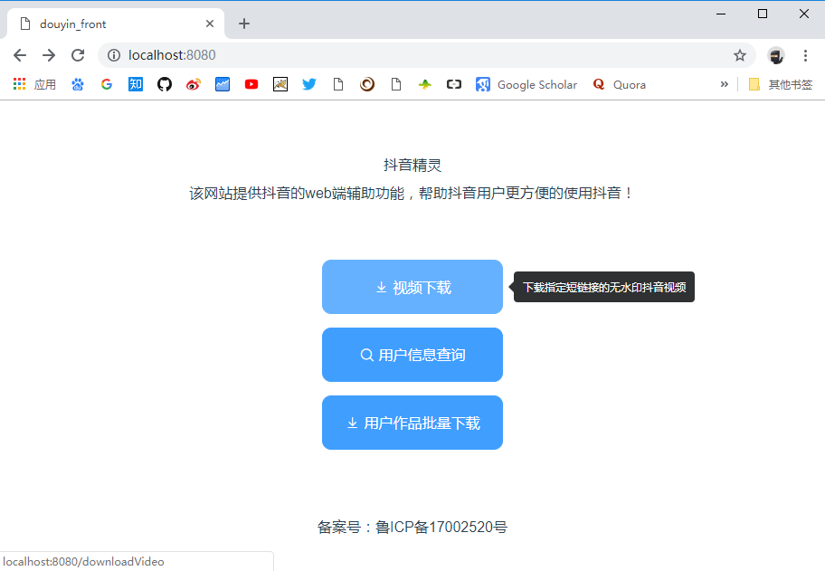
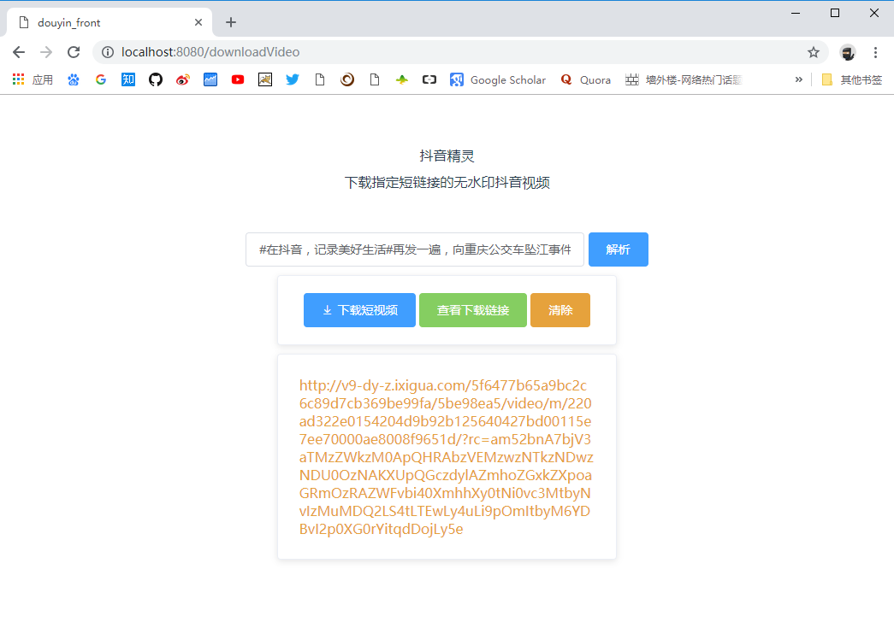

# douyin_front

> 抖音精灵的前端项目，后端项目地址：[elliotxx/douyin_back](https://github.com/elliotxx/douyin_back)

> 演示地址：[http://douyin.yangyingming.com](http://douyin.yangyingming.com)

## 效果图




## 安装 
1. 首先修改 src/main.js line 17 的后端请求地址，后端项目地址见：[elliotxx/douyin_back](https://github.com/elliotxx/douyin_back)
```
Vue.prototype.douyinhost = "http://douyin.test.com:8005";
```
2. 然后安装依赖以及打包应用
```bash
# install dependencies
npm install

# build for production with minification
npm run build
```
3. 最后 dist/ 目录中的便是打包好的静态网站了，可以使用 nginx 等服务器指向该目录。

## 使用 Docker
1. 首先修改 src/main.js line 17 的后端请求地址，后端项目地址见：[elliotxx/douyin_back](https://github.com/elliotxx/douyin_back)
```
Vue.prototype.douyinhost = "http://douyin.test.com:8005";
```
2. 然后构建容器
```
# 构建镜像
docker build -t douyin_front .

# 启动容器
docker run --name douyin_front -p 8006:80 -d douyin_front

# 查看运行中的容器
docker container ls
```
3. 如果容器正常启动，服务就可以通过 http://localhost:8006 进行访问。


## TODO

- [x] 无水印视频下载
- [x] 解析视频时的加载图标
- [x] 清除按钮
- [x] 抖音用户信息查询（已失效）
- [ ] 适配移动端
- [ ] 导航栏（首页按钮）
- [ ] 指定用户作品批量下载
- [ ] 解析完用 DPlayer 播放视频
- [ ] 抖音老视频博物馆
- [ ] 指定用户收藏的 bgm 批量下载
- [ ] 指定用户收藏的视频批量下载
- [ ] 抖音高赞视频展览馆
- [ ] 缓存抖音所有的视频链接和信息
