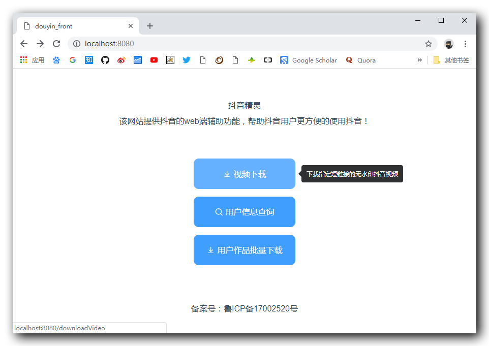

# douyin_front

> 抖音精灵的前端项目，后端项目地址：[elliotxx/douyin_back](https://github.com/elliotxx/douyin_back)

> 演示地址：[http://douyin.yangyingming.com](http://douyin.yangyingming.com)

## 效果图



## Build Setup

```bash
# install dependencies
npm install

# serve with hot reload at localhost:8080
npm run dev

# build for production with minification
npm run build

# build for production and view the bundle analyzer report
npm run build --report
```

For a detailed explanation on how things work, check out the [guide](http://vuejs-templates.github.io/webpack/) and [docs for vue-loader](http://vuejs.github.io/vue-loader).

## TODO

- [x] 无水印视频下载
- [x] 解析视频时的加载图标
- [x] 清除按钮
- [x] 抖音用户信息查询（已失效）
- [ ] 适配移动端
- [ ] 导航栏（首页按钮）
- [ ] 指定用户作品批量下载
- [ ] 解析完用 DPlayer 播放视频
- [ ] 抖音老视频博物馆
- [ ] 指定用户收藏的 bgm 批量下载
- [ ] 指定用户收藏的视频批量下载
- [ ] 抖音高赞视频展览馆
- [ ] 缓存抖音所有的视频链接和信息
